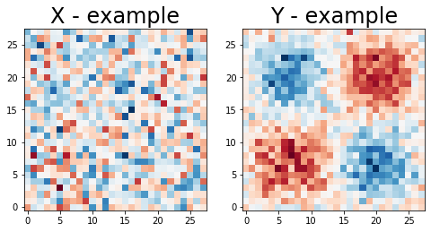
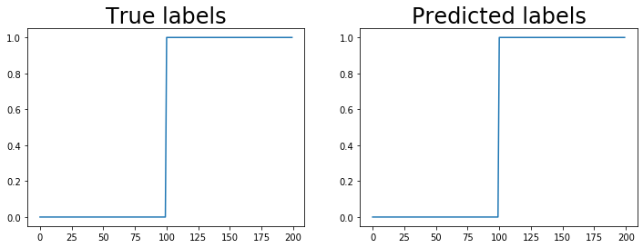

```python
# numpy always
import numpy as np

# for generating wavy data
from math import pi

# torch
import torch
import torch.nn as nn
import torch.optim as optim

# plotting
import matplotlib
import matplotlib.pyplot as plt

# when you generate the network it will automatically go onto the GPU
torch.set_default_tensor_type('torch.cuda.FloatTensor')
```


```python
# generate 2d white noise with given parameters
def wn2d(n = 100, mu = 0, sd = 1, l = 0.5, pts = 20):
    cf = np.zeros((pts**2, pts**2))
    np.fill_diagonal(cf, sd)
    
    if(isinstance(mu, int)):
        mf = np.tile(mu, cf.shape[0])
    else:
        mf = mu
    
    wn = np.random.multivariate_normal(mf, cf, n)
    return np.reshape(wn, (n, p, p))

# 100, 28x28 white noise field
n = 100
p = 28
ts = np.linspace(0, 1, p)

# generate mean function 
mu = np.outer(2*np.sin(2*pi*ts), 2*np.sin(2*pi*ts))
mu = np.reshape(mu, mu.size)

# Two samples. X has 0 mean. Y has wavy mean. We will try to predict which is which.
x = wn2d(n, mu = 0, pts = p)
y = wn2d(n, mu = mu, pts = p)
```


```python
fig, ax = plt.subplots(1, 2, figsize = (8, 4))

ax[0].imshow(x[0,...], origin = 'bottom', cmap = 'RdBu_r')
ax[0].set_title('X - example', fontsize = 24)
ax[1].imshow(y[0,...], origin = 'bottom', cmap = 'RdBu_r')
ax[1].set_title('Y - example', fontsize = 24)
plt.show()
```





```python
# convert x, y to "long" format. rows = obs, cols = features (pixel values)
x = np.reshape(x, (n, p*p))
y = np.reshape(y, (n, p*p))

# stack them on top of each other
df = np.concatenate([x, y], axis = 0)

# generate class labels
label = np.repeat([0, 1], 100)
label = np.reshape(label, (200, 1))

# convert to torch's format (from_numpy). Correct the type (float). Move to GPU (cuda)
df = torch.from_numpy(df).float().cuda()
label = torch.from_numpy(label).float().cuda()
```


```python
# in pytorch you define your network as a class 
# needs an __init__ function to define network parameters (instantiate the network)
# needs a forward function to tell pytorch how to move data through the network
class simpleNN(nn.Module):
    def __init__(self):
        super(simpleNN, self).__init__()
        self.model = nn.Sequential(
            # input dim = number of features, output dim (1st hidden) = 500. Use ReLU nonlinearity.
            nn.Linear(p*p, 500), nn.ReLU(),
            
            # input dim = output of previous layer. Output = 250 (2nd hidden). ReLU again.
            nn.Linear(500, 250), nn.ReLU(),
            
            # input dim = output of previous layer. Output = 1 dim. No activation on output
            nn.Linear(250, 1)
        )
    
    # forward says how to move data from the beginning to the end of the network
    def forward(self, x):
        return self.model(x)
```


```python
# instantiate network
snn = simpleNN()

# define optimizer for the network's parameters
optimizer = optim.Adam(snn.parameters(), lr = 1e-3)

# define a loss function / minimization criteria for the optimizer
# MSE loss is not ideal for classication but its simple and works fine in this case
criterion = nn.MSELoss()
```


```python
epochs = 1000
for j in range(epochs):
    # reset loss value at the beginning of each training epoch
    loss = 0
    
    # reset gradients. Otherwise they accumulate!
    optimizer.zero_grad()
    
    # predict label from the data (df) using the simple NN (snn) (all observations at once)
    label_hat = snn(df)
    
    # evaluate results
    loss = criterion(label, label_hat)
    
    # backprop the error
    loss.backward()
    
    # update the weights
    optimizer.step()
    
    # print how we're doing every so often
    if j % (epochs / 20) == 0:
        print("[iteration %04d] loss: %.6f" % (j, loss))
        
print("[iteration %04d] loss: %.6f" % (j+1, loss))
```

    [iteration 0000] loss: 0.535031
    [iteration 0050] loss: 0.000730
    [iteration 0100] loss: 0.000069
    [iteration 0150] loss: 0.000021
    [iteration 0200] loss: 0.000007
    [iteration 0250] loss: 0.000002
    [iteration 0300] loss: 0.000001
    [iteration 0350] loss: 0.000000
    [iteration 0400] loss: 0.000000
    [iteration 0450] loss: 0.000000
    [iteration 0500] loss: 0.000000
    [iteration 0550] loss: 0.000000
    [iteration 0600] loss: 0.000000
    [iteration 0650] loss: 0.000000
    [iteration 0700] loss: 0.000000
    [iteration 0750] loss: 0.000000
    [iteration 0800] loss: 0.000000
    [iteration 0850] loss: 0.000000
    [iteration 0900] loss: 0.000000
    [iteration 0950] loss: 0.000000
    [iteration 1000] loss: 0.000000


```python
# Run data through the trained NN. Move to cpu (cpu). Extract values (detach). Convert to numpy
# last 3 steps needed to plot values
label_hat = snn(df).cpu().detach().numpy()

# bring labels back to cpu and into numpy
label = label.cpu().detach().numpy()
```


```python
# lo and behold it worked. First 100 are 0 (X's label). Second 100 are 1 (Y's label)
fig, ax = plt.subplots(1, 2, figsize = (12, 4))
ax[0].plot(label)
ax[0].set_title('True labels', fontsize = 24)
ax[1].plot(label_hat)
ax[1].set_title('Predicted labels', fontsize = 24)
plt.show()
```





```python

```
